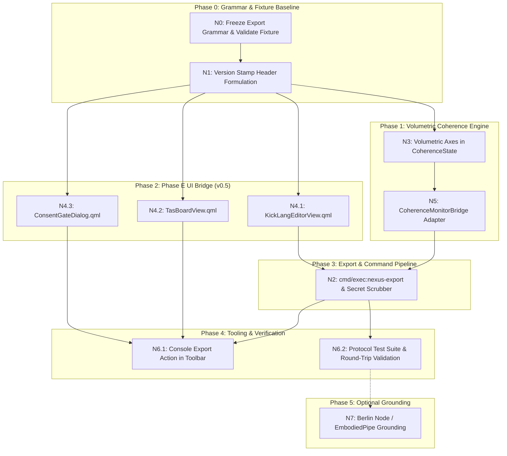

# t484 v0.6 — OCS/Node Nexus Sequenced Execution Plan

**Living Document / Master Execution Plan**  
Canonical Repository: `deniskropp/t484` @ `main`  
Canonical Product Skill: `ocs-node-engine`  
Status: **Plan & Sequence Specification** (Shipped Baseline: **v0.4**, CMake `0.4.0`)

---

## 1. Executive Summary & Objective

The objective of **v0.6 (OCS/Node Nexus)** is to evolve the C++20 protocol core and Qt 6 / QML interactive chat and protocol console into a **Volumetric Coherence Nexus** whose entire operator state is captured in **one single KickLang/OCS (`.ocs`) file** — exportable, re-ingestible, and consent-gated.

```
⫻data/obj:
Make t484 a Nexus whose entire operator state is one KickLang/OCS file — exportable, re-ingestible, consent-gated.
```

### Core Tenet
The `.ocs` export is **not** a chat snippet, **not** an incidental log, and **not** a separate serialization format. It is the **living protocol document itself**, parsed directly by [`ProtocolParser`](file:///home/dok/Projects/t484/include/ocsnode/ProtocolParser.h) and emitted by [`ProtocolEmitter`](file:///home/dok/Projects/t484/include/ocsnode/ProtocolEmitter.h) without intermediate JSON wrappers, database sidecars, or parallel chat stores.

---

## 2. Invariants & Non-Goals

1. **Protocol Freeze:** No new section families beyond the frozen surface in [`docs/ARCHITECTURE.md`](file:///home/dok/Projects/t484/docs/ARCHITECTURE.md).
2. **Zero Secrets in Export:** No API keys (`GEMINI_API_KEY`, `GOOGLE_API_KEY`), raw `x-goog-api-key` headers, or private `.env` filesystem paths written into any `.ocs` export. Safe label notation (`env:GEMINI_API_KEY`) is permitted in UI metadata only.
3. **No Parallel Store:** The `std::vector<Section>` inside [`ProtocolEngine`](file:///home/dok/Projects/t484/include/ocsnode/ProtocolEngine.h) remains the single source of truth for chat transcript, architecture, objective, TAS, and control state.
4. **Consent & Halt Invariance:** `cmd/halt` is first-class. Export while gated is permitted (read-only snapshot). Import of a document containing `cmd/halt` stays gated. Resume is strictly achieved by loading a protocol document *without* `cmd/halt` (no invented `cmd/resume`).
5. **Naming Freeze:** C++ types use `*Model` / `*Item` (`include/ocsnode/qt/`); QML views use `*View.qml` (`src/qml/OcsNode/`). C++ and QML identifiers must never collide.
6. **No Phantom Claims:** Do not claim v0.6 shipped until `nexus-v0.6.ocs` round-trips losslessly in `ocsnode_protocol_tests` and export/import is wired end-to-end.

---

## 3. Architecture & Topology

```
┌─────────────────────────────────────────────────────────────────────────────┐
│ QML Surfaces (OcsNode 1.0)                                                  │
│   • main.qml (Compact Chat)               • console.qml (3-Pane Dashboard)  │
│   • KickLangEditorView.qml (Phase E)      • TasBoardView.qml (Phase E)      │
│   • ConsentGateDialog.qml (Phase E)       • Theme singleton (OCS Slate)     │
└──────────────────────────────────────┬──────────────────────────────────────┘
                                       │ context properties: engine, tasModel,
                                       │ klmxItem, eventLogModel
┌──────────────────────────────────────▼──────────────────────────────────────┐
│ Qt Façade & Models (Qt 6 Core, Gui, Qml, Quick, Network)                    │
│   • ProtocolEngineQt                      • SectionListModel                │
│   • TasStatusModel                        • KlmxMoleculeItem                │
│   • EventLogModel                         • GenAiClient (HTTP Interactions) │
└──────────────────────────────────────┬──────────────────────────────────────┘
                                       │ NodeEngine.protocol()
┌──────────────────────────────────────▼──────────────────────────────────────┐
│ STL Protocol Core (C++20, Zero Qt / Zero Network)                           │
│   • ProtocolEngine                        • ChatSession                     │
│   • ProtocolParser                        • ProtocolEmitter                 │
│   • CoherenceState (7 Volumetric Axes)    • Section, ParseResult            │
└─────────────────────────────────────────────────────────────────────────────┘
```

---

## 4. Volumetric Coherence Specification

The scalar coherence metric `coherence ∈ [0.0, 1.0]` is preserved for backward compatibility with the status bar and v0.4 chrome. v0.6 expands [`CoherenceState`](file:///home/dok/Projects/t484/include/ocsnode/CoherenceState.h) with 7 deterministic volumetric axes:

| Volumetric Axis | Source Section(s) | Evaluation Rule & Meaning |
|---|---|---|
| `protocol` | `protocol/ocs` | Valid identity header and version stamp present (`[version=0.6.0]`) |
| `klmx` | `context/klmx` | Bound molecule, space, and formula definition |
| `objective` | `data/obj` | Active living objective present and non-empty |
| `tas` | `data/tas`, `data/ptas` | Active operational steps > 0 |
| `consent` | absence of `cmd/halt` | Ungated operational state (1.0 if clear, 0.0 if gated) |
| `dialogue` | `flow/chat` | Host turns and triad agent responses (`KickForge`, `KickFlow`, `KickGuard`) |
| `genai` | Qt runtime health | `genaiReady && !busy` (Qt façade only; omitted or masked in STL core) |

The export writes these evaluated axes into `display/meta` for operator visibility.

---

## 5. Nexus Export & Import Grammar

### Header Format
```
⫻protocol/ocs: [node=OCS/Root] [repo=deniskropp/t484] [ref=main] [version=0.6.0]
⫻cmd/exec:ocs-node-engine
⫻cmd/mode:Hybrid
⫻cmd/lang:DE
⫻context/klmx:Kick/Lang
```

### Layer Ordering in `.ocs` Export Snapshot
1. `protocol/ocs` — Document identity, node, repo, ref, version stamp.
2. `cmd/exec` — Engine signature (`ocs-node-engine`) and optional execution traces.
3. `cmd/mode` — Active mode (`Fluid`, `Swarm`, `Predictive`, `Hybrid`).
4. `cmd/lang` — Optional language identifier (`DE`, `EN`, `KickLang`).
5. `context/klmx` — KickLang molecule, formula, model, space, scope, reference.
6. `data/obj` — Living objective.
7. `data/tas` and `data/ptas` — Ordered execution steps.
8. `display/header` & `display/meta` — Header banner and volumetric axes audit table.
9. `flow/chat:*` — Chronological conversation turns forming the document transcript.
10. `cmd/halt` — Gating section (only if session is in halted state).

### Lossless Round-Trip Guarantee
```
parse(emitText(parse(nexus-v0.6.ocs))) ≡ parse(nexus-v0.6.ocs)
```
Must strictly preserve section count, section order, `family/path`, qualifiers, and multiline bodies.

---

## 6. Sequenced Implementation Flow (N0 → N7)



---

### Detailed Step-by-Step Task Sequence

### Phase 0: Grammar & Fixture Baseline (Tasks N0, N1)

- [x] **Task 0.1 (N0): Grammar Specification & Fixture Validation**
  - **Source Files:** [`docs/plans/v0.6/NEXUS-EXPORT.md`](file:///home/dok/Projects/t484/docs/plans/v0.6/NEXUS-EXPORT.md), [`src/assets/nexus-v0.6.ocs`](file:///home/dok/Projects/t484/src/assets/nexus-v0.6.ocs).
  - **Action:** Confirm that `nexus-v0.6.ocs` parses with zero errors in [`ProtocolParser`](file:///home/dok/Projects/t484/include/ocsnode/ProtocolParser.h).
  - **Status:** **Completed / Landed as Plan Artifacts**.

- [x] **Task 0.2 (N1): Header Version Stamp Specification**
  - **Format:** `⫻protocol/ocs: [node=OCS/Root] [repo=deniskropp/t484] [ref=main] [version=0.6.0]`
  - **Action:** Ensure bracket attribute list is preserved as opaque qualifier by parser.
  - **Status:** **Completed / Landed in Fixtures**.

---

### Phase 1: Volumetric Coherence Engine (Tasks N3, N5)

- [ ] **Task 1.1 (N3): Extend `CoherenceState` with Volumetric Axes**
  - **Target File:** [`include/ocsnode/CoherenceState.h`](file:///home/dok/Projects/t484/include/ocsnode/CoherenceState.h)
  - **Implementation:**
    - Add `struct VolumetricAxes { double protocol; double klmx; double objective; double tas; double consent; double dialogue; double genai; };` to [`CoherenceState`](file:///home/dok/Projects/t484/include/ocsnode/CoherenceState.h).
    - Retain scalar `coherence` in `[0.0, 1.0]` as the aggregated product/mean for status bar chrome.
    - Implement axis scoring rules:
      - `axisProtocol = hasProtocol ? 1.0 : 0.0`
      - `axisKlmx = hasKlmx ? 1.0 : 0.0`
      - `axisObjective = hasObj ? 1.0 : 0.0`
      - `axisTas = activeSteps > 0 ? std::min(1.0, activeSteps / 5.0) : 0.0`
      - `axisConsent = hasHalt ? 0.0 : 1.0`
      - `axisDialogue = std::min(1.0, hostTurns * 0.25 + replies * 0.15)`
      - `axisGenai = genaiReady && !busy ? 1.0 : 0.5` (Qt façade overlay).

- [ ] **Task 1.2 (N5): Define `CoherenceMonitorBridge` Interface**
  - **Target Files:** [`include/ocsnode/CoherenceState.h`](file:///home/dok/Projects/t484/include/ocsnode/CoherenceState.h), [`src/engine/ProtocolEngine.cpp`](file:///home/dok/Projects/t484/src/engine/ProtocolEngine.cpp)
  - **Implementation:**
    - Abstract `ICoherenceBridge` or adapter slot behind `deriveCoherence` to permit pluggable telemetry monitors without modifying core parser/emitter.

- [ ] **Task 1.3: Expose Volumetric Axes to Qt / QML**
  - **Target Files:** [`include/ocsnode/qt/ProtocolEngineQt.h`](file:///home/dok/Projects/t484/include/ocsnode/qt/ProtocolEngineQt.h), [`src/engine/ProtocolEngineQt.cpp`](file:///home/dok/Projects/t484/src/engine/ProtocolEngineQt.cpp)
  - **Implementation:**
    - Expose `Q_PROPERTY(QVariantMap volumetricAxes READ volumetricAxes NOTIFY stateChanged)`.
    - Provide invokable helper for radar/meter bindings in console views.

---

### Phase 2: Phase E UI Bridge Surfaces (Task N4)

*Note: Phase E views (v0.5) provide the operator surfaces required by v0.6 Nexus.*

- [ ] **Task 2.1 (N4.1): `KickLangEditorView.qml`**
  - **Target File:** `src/qml/OcsNode/KickLangEditorView.qml`
  - **Role:** Syntax-highlighted viewer and editor for the living KickLang document.
  - **Features:**
    - Real-time binding to `protocol.sourceText`.
    - Integrated "Ingest" button calling `protocol.loadText(editorContent)`.
    - "Export" button generating timestamped snapshot.
    - OCS Slate styling via `Theme` singleton.

- [ ] **Task 2.2 (N4.2): `TasBoardView.qml`**
  - **Target File:** `src/qml/OcsNode/TasBoardView.qml`
  - **Role:** Interactive TAS / PTAS step board.
  - **Features:**
    - Bound to `tasModel` (`TasStatusModel`).
    - Visual step status (`running`, `complete`, `pending`, `partial`, `gated`).
    - Step filtering and progress indicators.

- [ ] **Task 2.3 (N4.3): `ConsentGateDialog.qml`**
  - **Target File:** `src/qml/OcsNode/ConsentGateDialog.qml`
  - **Role:** Dedicated modal overlay when `protocol.gated == true`.
  - **Features:**
    - Displays `protocol.haltReason`.
    - Clear unhalt instruction: Load document without `cmd/halt` or supply override payload.
    - Disallows invalid `/resume` commands.

- [ ] **Task 2.4: Module Registration & Build Integration**
  - **Target Files:** [`CMakeLists.txt`](file:///home/dok/Projects/t484/CMakeLists.txt), `src/qml/OcsNode/qmldir`
  - **Action:** Register new QML views in `T484_QML_FILES`, add resource aliases, and verify build.

---

### Phase 3: Export & Command Pipeline (Task N2)

- [ ] **Task 3.1 (N2.1): `cmd/exec:nexus-export` Command Handler**
  - **Target Files:** [`src/protocol/ChatSession.cpp`](file:///home/dok/Projects/t484/src/protocol/ChatSession.cpp), [`src/engine/ProtocolEngine.cpp`](file:///home/dok/Projects/t484/src/engine/ProtocolEngine.cpp)
  - **Implementation:**
    - When `/exec nexus-export` or `cmd/exec:nexus-export` is encountered:
      1. Ensure header is stamped with `[version=0.6.0] [repo=deniskropp/t484] [ref=main]`.
      2. Construct / update `display/meta` with volumetric axes table.
      3. Call `emitText()` to generate the lossless snapshot.
      4. Append audit reply section `flow/chat:KickFlow` confirming export readiness.

- [ ] **Task 3.2 (N2.2): Secret Sanitization & Scrubber Guarantee**
  - **Target File:** [`src/engine/ProtocolEngine.cpp`](file:///home/dok/Projects/t484/src/engine/ProtocolEngine.cpp)
  - **Validation:**
    - Guarantee `emitText()` never extracts or serializes values from `GenAiClient::apiKey()`.
    - Filter any accidental secret substrings before writing snapshot.

---

### Phase 4: Tooling, Console Actions & Verification (Task N6)

- [ ] **Task 4.1 (N6.1): Console "Export Nexus" Action Integration**
  - **Target Files:** [`src/qml/console.qml`](file:///home/dok/Projects/t484/src/qml/console.qml), [`src/qml/OcsNode/OcsSettingsPanelView.qml`](file:///home/dok/Projects/t484/src/qml/OcsNode/OcsSettingsPanelView.qml)
  - **Implementation:**
    - Add "Export Nexus" and "Copy Living Document" buttons to console header/toolbar.
    - Pure QML binding to `protocol.emitText()` + clipboard / file saver.
    - Zero new C++ properties invented for button chrome.

- [ ] **Task 4.2 (N6.2): Comprehensive Protocol Test Suite Extension**
  - **Target File:** [`tests/test_protocol.cpp`](file:///home/dok/Projects/t484/tests/test_protocol.cpp)
  - **Test Cases:**
    1. Parse and round-trip `nexus-v0.6.ocs` fixture.
    2. Parse and round-trip `seed-nexus.ocs` fixture.
    3. Volumetric axes calculation verification (all 7 axes evaluated accurately).
    4. `cmd/exec:nexus-export` output validation (lossless, zero secrets).
    5. Gated session export validation (export allowed while gated; import with halt stays gated).
    6. Non-empty round-trip equality: `parse(emit(parse(nexus-v0.6.ocs)))`.

- [ ] **Task 4.3: GenAI Parse & Health Verification**
  - **Target File:** `tests/test_genai.cpp`
  - **Validation:** Offline `.env` parsing, model chain fallback parsing (`gemini-3.7-flash` → `3.6` → `3.5`).

---

### Phase 5: Optional Grounding (Task N7)

- [ ] **Task 5.1 (N7): Berlin Node / EmbodiedPipe Adapter (Optional / Post-v0.6)**
  - **Target:** External hardware / 3D data pathway bridge.
  - **Status:** Out of critical path; non-blocking for core v0.6 release.

---

## 7. Acceptance Criteria & Definition of Done (v0.6)

Before tagging CMake version `0.6.0` and declaring v0.6 shipped:

1. [ ] `ocsnode_protocol_tests` passes 100% of tests including `nexus-v0.6.ocs` and `seed-nexus.ocs` round-trips.
2. [ ] `deriveCoherence` computes all 7 volumetric axes deterministically.
3. [ ] `cmd/exec:nexus-export` produces a valid, secret-free `.ocs` document.
4. [ ] Ingesting a generated export via `ProtocolEngine::loadText` restores exact state and active steps.
5. [ ] Phase E views (`KickLangEditorView`, `TasBoardView`, `ConsentGateDialog`) render cleanly under OCS Slate theme in both `t484` and `t484-console`.
6. [ ] Halt gate invariance verified: No mutation or LLM dispatch occurs while gated.
7. [ ] C++ API headers in `include/ocsnode/*.h` conform strictly to naming and encapsulation freezes.
