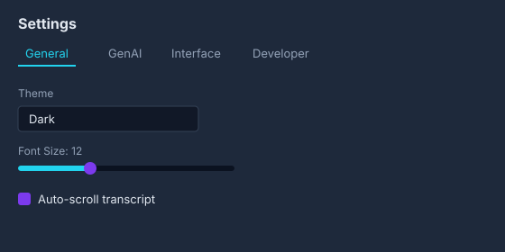
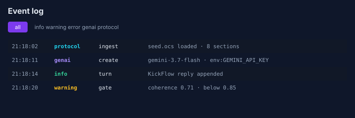
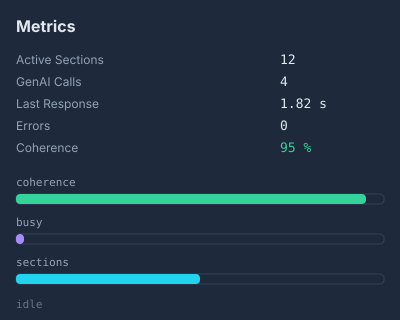

# t484 Protocol Console

Second Qt 6 shell for the same `ProtocolEngineQt`. The chat app (`./build/t484`) stays the compact two-pane transcript. The console (`./build/t484-console`) is the three-pane operator dashboard from the pasted layout.

Rendered plates for every pane: [`PANELS.md`](PANELS.md). Theme tokens: [`THEME.md`](THEME.md).

## Layout

```
┌ status bar + view mode (chat|inspect|dev) + cmd/mode ─────────────┐
│ LEFT                 │ CENTER                    │ RIGHT          │
│ transcript           │ settings tabs             │ metrics        │
│ composer             │ event log                 │ live meters    │
│ TAS + molecule       │                           │                │
└───────────────────────────────────────────────────────────────┘
```







## Binding rules

Same freeze as `main.qml`:

- context property `engine` is `ProtocolEngineQt`
- shell alias `readonly property var protocol: engine`
- children take `protocol: appWindow.protocol`

The pasted sketch referenced properties the engine does not expose (`genaiCallCount`, `avgResponseTime`, `logsModel`, `tasModel.memory`, Qt 5 `TableViewColumn`). Those surfaces are implemented in QML:

| Sketch | Console implementation |
|---|---|
| `protocol.genaiCallCount` | counted from `turnCompleted` |
| `protocol.avgResponseTime` | measured from `busy` edges |
| `logsModel` | `OcsEventLogView` ListModel |
| `tasModel.memory` | TAS step count (no process RSS API) |
| `setMode("chat")` | view-mode combo; protocol mode stays `Hybrid\|Fluid\|Swarm\|Predictive` |
| API key field | read-only `genaiSource` — key is never written into a section |

## Launch

```bash
./build/t484-console
./build/t484 --console
./build/t484-console --chat
```
