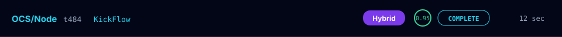
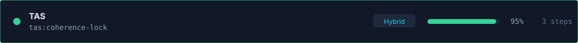
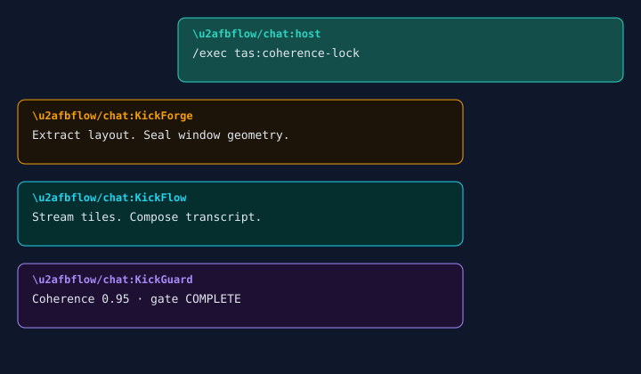
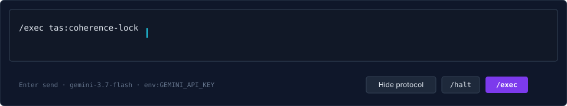
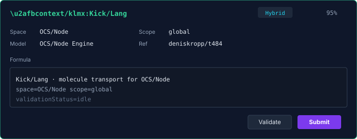
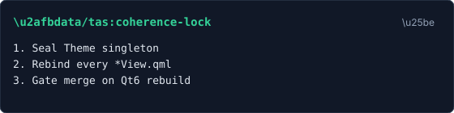

# t484 QML panel catalog

Rendered plates for every shipped `OcsNode 1.0` surface under the **OCS Slate**
theme. Source of color tokens: [`THEME.md`](THEME.md) / `src/qml/OcsNode/Theme.qml`.

These SVGs are documentation plates — they follow the live QML layout and
labels. They are not screenshots of a running binary.

| Surface | File | Plate |
|---|---|---|
| Chat shell `main.qml` | `src/qml/main.qml` | bubbles + composer + status |
| Protocol console `console.qml` | `src/qml/console.qml` | settings + log + metrics |
| `ProtocolStatusBar` | chrome | [protocol-status-bar.svg](images/protocol-status-bar.svg) |
| `TasStatusBarView` | TAS strip | [tas-status-bar.svg](images/tas-status-bar.svg) |
| `OcsChatBubbleView` | transcript delegate | [chat-bubbles.svg](images/chat-bubbles.svg) |
| `OcsComposerView` | input | [composer.svg](images/composer.svg) |
| `KlmxMoleculeSpaceView` | inspector | [klmx-molecule.svg](images/klmx-molecule.svg) |
| `OcsSectionView` | section card | [section-card.svg](images/section-card.svg) |
| `OcsSettingsPanelView` | console | [settings-panel.svg](images/settings-panel.svg) |
| `OcsEventLogView` | console | [event-log.svg](images/event-log.svg) |
| `OcsMetricsPanelView` | console | [metrics-panel.svg](images/metrics-panel.svg) |

`OcsChatTranscriptView` is the ListView that hosts `OcsChatBubbleView`; it has
no chrome of its own beyond `Theme.bg`.

---

## ProtocolStatusBar

Bindings: `mode`, `status`, `coherence`, `gated`, `actor`, `sectionCount`,
`busy`, `genaiReady`, `genaiModel`, `genaiSource`.

## TasStatusBarView

Bindings: `TasStatusModel` (`status`, `mode`, `coherence`, `currentTasId`,
`activeSteps`, `gated`). `haltRequested` → `protocol.requestHalt`.

## OcsChatBubbleView

Host aligns right (`flow` + `host`/`user`). Agent fills come from
`Theme.roleFill(qualifier, family, isHost)`:

- host — teal
- KickForge — amber
- KickFlow — cyan
- KickGuard — violet

## OcsComposerView

Enter sends; Shift+Enter newline. `/halt` calls `requestHalt`. `/exec` (Send)
calls `protocol.sendChat`.

## KlmxMoleculeSpaceView

Bound to `KlmxMoleculeItem`. Submit → `protocol.submitMap`.

## OcsSectionView

Shipped card for a single section. Not on the v0.4 chat layout (bubbles
replaced the card list). Keep for inspector / Phase E.

## OcsSettingsPanelView

General writes `Theme.name` (`Dark` / `Light`). GenAI fields are read-only
(`genaiSource`, `genaiModel`) — the key is never a section.

## OcsEventLogView

Filter chips: `all` `info` `warning` `error` `genai` `protocol`.
Level color from `Theme.levelColor`.

## OcsMetricsPanelView

Meters: coherence, busy, errors, sections. No extra chart dependency.

---

## Shell composition

`main.qml` (chat): status bar → TAS strip → transcript + composer | KLMX + raw source.

`console.qml` (dashboard): status bar → view/mode strip → transcript + composer
+ TAS/KLMX | settings + event log | metrics.
